# LaBoum

#### 들려주는 영화추천 서비스 

> 영화 OST만 들었는데, 그 영화의 분위기와 장르가 그려지는 경험..
> 누구나 한번 쯤은 있을 것이다.
>
> 우리 프로젝트는 이 경험에서 출발했다.
> 모든 영화는 OST가 있고, 각 장르를 대표하는 OST들이 있으며,
> OST를 듣는 것 만으로도 사용자의 영화 선택에 영향을 미칠 수 있다고 생각했다.
>
> OST를 들려주고, 영화 장르를 추천하자!

## 1. 팀원 정보 및 업무 분담 

> 역할

| 직책 | 이름   | 메인      | 서브      |
| ---- | ------ | --------- | --------- |
| 팀장 | 이현우 | Frone-end | Back-end  |
| 팀원 | 서우림 | Back-end  | Front-end |

> 업무 내역 

|        | Front-end                                                    | Back-end                                                     |
| ------ | ------------------------------------------------------------ | ------------------------------------------------------------ |
| 이현우 | Movie  - index(OST), recommend, Top10 Community - Index, create, detail + 팀원이 한 Front 외 전부! | Movie - Genre recomended by ost - Genre recommended by vote_avg Community  |
| 서우림 | Accounts - loign, signup Movie - Color, detail | Movie - Genre recommended by color - Youtube API를 활용하여 예고편 가져오기 - Db 내에 있는 Movie 검색기능 Accounts + 팀장이 한 Back 외 전부! |

## 2. 프로젝트 구성 & 기술 스택

|       | 언어                    | Framework | Db      | etc                              |
| ----- | ----------------------- | --------- | ------- | -------------------------------- |
| Front | Python, JavaScript | Vanila JS |         | Bootstrap, HTML5, CSS3 |
| Back  | Python                  | Django    | sqlite3 | venv                             |

---

## 3. 목표 서비스 구현 및 실제 구현 정도

### 3.1 Prototype

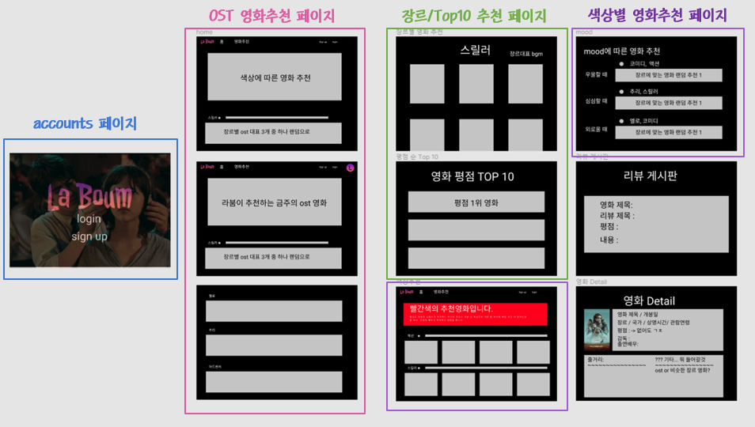

- Accounts
  - 회원가입, 로그인, 로그아웃, 관리자 admin페이지 
- Movie
  - OST 영화 추천
  - 색상별 영화 추천
  - Mood에 따른 영화 추천
  - 장르별 영화 Page
  - Movie Detail
- 리뷰 게시판

> 사전 계획한 모든 서비스는 구현 완료
> 다만, 색상과 mood를 나누지 않고, 색상에서 mood를 함께 녹여내는 방식으로 통합하여 구현함

### 3.2 실제 구현 서비스 

- Accounts

  - 회원가입
  - 로그인, 로그아웃
  - 관리자 admin

- Movie

  - 영화 장르별 필터링

  - 영화 상세보기

  - 유튜브 API를 활용한 예고편 영상 가져오기

  - 영화 OST 제목과 static 파일을 연동하여 

  - OST Audio 기능 활성화

  - Color 선택에 따라 영화 추천 기능

  - 영화 검색기능

  - 평점 순위에 따른 영화 추천 기능

- Community
  - 게시글 CRUD
  - 게시글 좋아요 기능
  - 게시글 댓글 달기
  - 게시글 댓글 목록
  - 게시글 댓글 삭제 기능

## 4. 데이터 베이스 모델링(ERD)

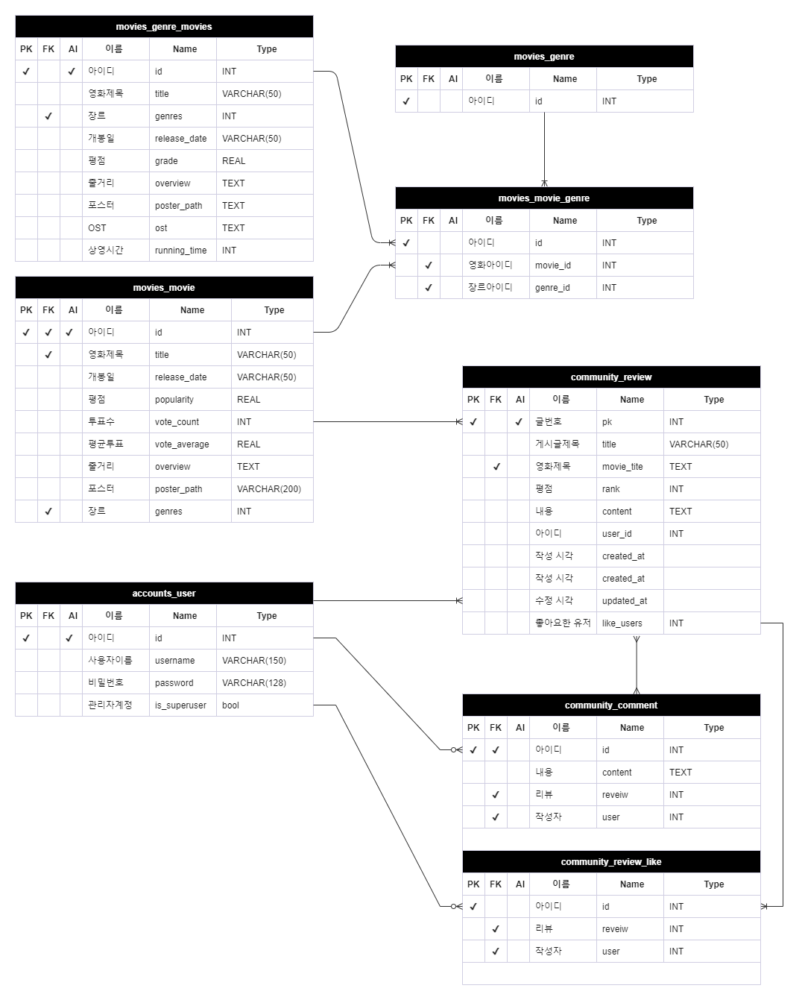

## 5. 필수 기능 

### 5.1 Accounts

> 회원가입/ 로그인 

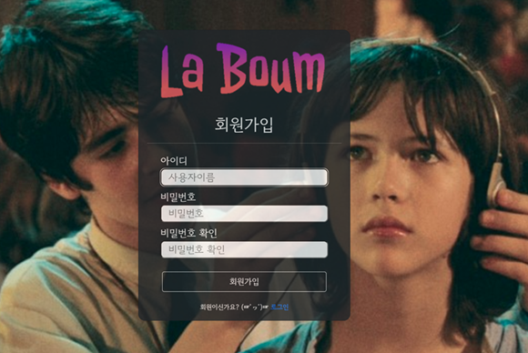

- 모든 페이지는 회원가입 후 로그인을 해야 접근이 가능도록 `@login_required` 데코레이터를 작성
- 로그인 하지 않고 GET 방식(url접근)으로 다른 페이지 접근할 경우, login 페이지로 redirect 되며, 로그인 후에는 next 파라미터로 기존 접근하려고 한 페이지로 넘어가게 된다.

### 5.2. Movie

#### 5.2.1 Index

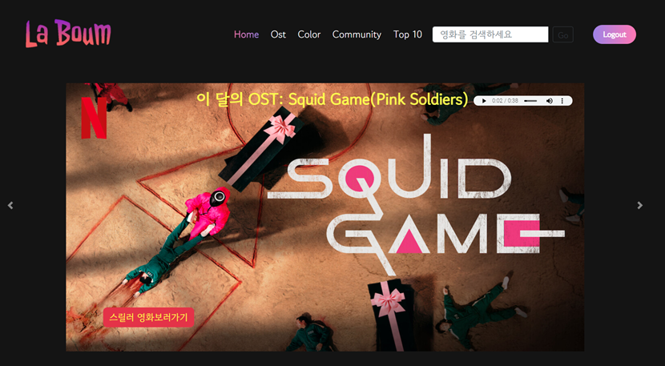

- Carousel을 활용하여 '이달의 OST영화 장르추천', 'Color를 이용한 장르추천', 'Community' 로 이동할 수 있도록 하였다. 
- index 페이지의 bgm은 이달의 OST가 자동 재생된다.
- nav바 상단에는 db에 있는 영화를 검색할 수 있다.
  - 검색이 성공하면 해당 영화의 detail 페이지로 이동
  - 검색 실패의 경우 그냥 index 페이지에 머무르게 됨

#### 5.2.2 Ost Movie Recommend

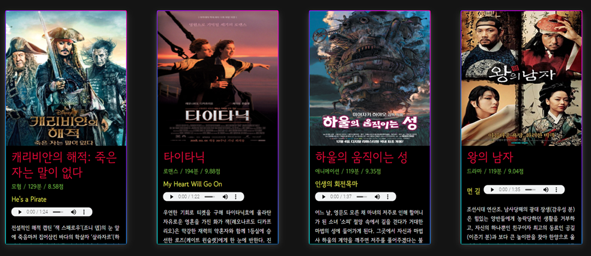

- 영화는 random하게 나오며, 각 영화에는 OST 하이라이트 부분이 나오도록 편집되어있다.
- 포스터/영화제목 클릭 시 영화 상세 페이지로 이동
- 카드의 장르를 선택하면 해당 장르 추천 페이지로 이동한다.

#### 5.2.3 Genre Recommend

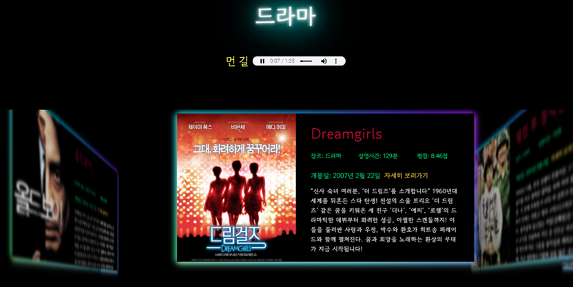

- 선택한 영화 장르의 대표 OST 가 재생된다.
- 영화의 간단한 정보를 포함한 card를 swipe 하며 고를 수 있다.
- '자세히보러가기' 클릭 시 영화 detail 페이지로 이동한다.

#### 5.2.4 Color Movie Recomend

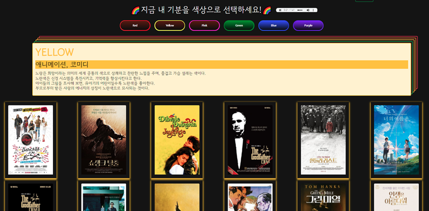

- 상단의 색상을 선택하는 버튼을 클릭하면, 색상별 테마와 함께 추천 영화가 변경된다.
- 각 색상은 mood와 theme에 맞는 영화를 추천해준다.
- 포스터 클릭 시 해당 영화의 detail 페이지로 이동하게 된다.

#### 5.2.5 TOP10

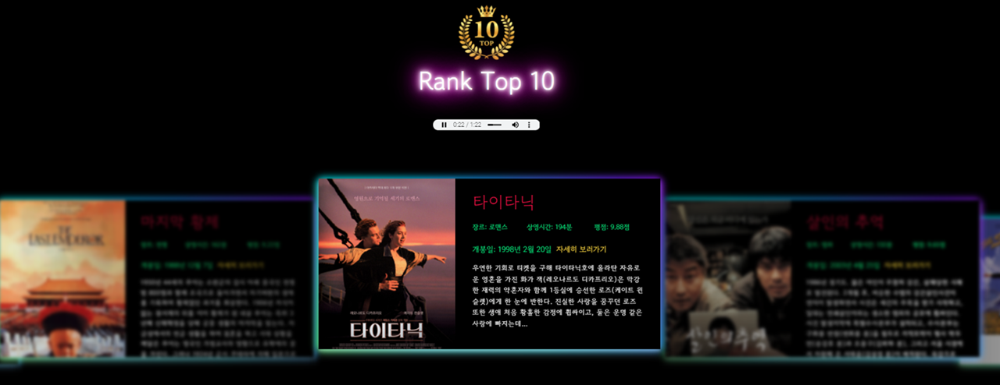

- 영화의 평점 순위에 따라 TOP10 영화 카드 목록이 나온다.
- 현재 1순위인 영화의 OST 가 자동 재생된다

### 5.3 Community

#### 5.3.1 Index

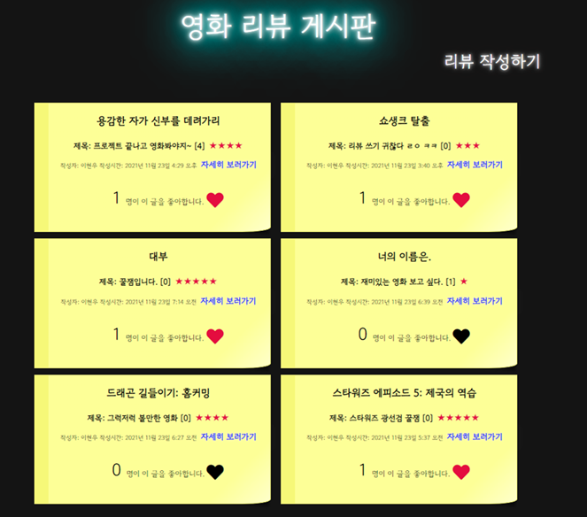

- 게시글의 영화제목, 리뷰제목, 평점 등 간단한 정보가 index card 내부에 배치된다.
- 좋아요 버튼은 Javascript 를 사용하여 비동기식으로 변하게 된다.

#### 5.3.2 Review Create

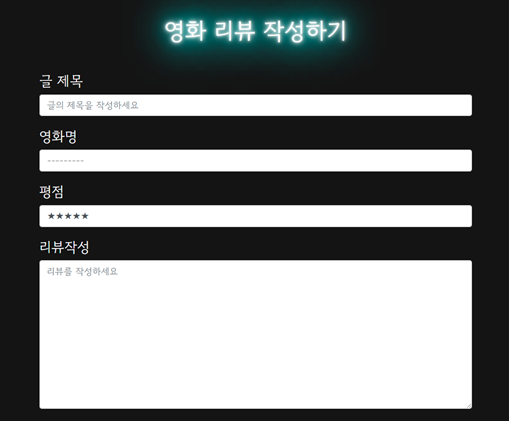

- 영화 리뷰를 작성할 때에는 서비스 내부에서 제공하는 영화에 대한 리뷰만 작성되도록 하였다.
- 영화 명은 db에 있는 영화 title 중 하나를 고르도록 설정하였다. 

#### 5.3.3 Review Detail

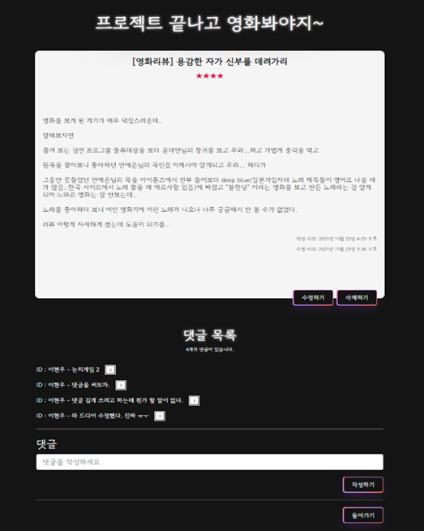

- 작성한 리뷰는 수정/삭제가 가능하며 댓글을 남길 수 있다.

- 해당 리뷰 하단에 댓글을 남길 수 있다. 

- 리뷰와 댓글 모두 작성자 본인만 수정이 가능하다. 

  

## 6. 느낀점

- 서우림

> 

- 이현우 

> 1학기에 했었던 모든 학습 활동 중 가장 재미있고, 배운 점이 많은 프로젝트였다.
>그동안 배웠던 모든 내용들을 실제로 프로젝트에 적용해 나가면서 하나하나 복습하고, 이해가 안됐었던 부분들도 이해할 수 있었다. 
>  이러한 과정에서 시작부터 계획했던 기능이나 구조, CSS등이 실제로 구현되었을 때, 큰 성취감을 느낄 수 있었고, 
>이 성취감들을 통해 프로젝트에 더욱 몰입하여 작업할 수 있었다.
> 
>내가 이렇게까지 열심히 할 거라는 생각은 없었는데,
> 마음이 맞는 팀원과 프로젝트 계획 및 구성 단계부터 완성하는 단계까지 서로 부족한 부분을 보완하고, 협업하며 목표한 바를 이룬 것 같아서 정말 뿌듯하고 기쁘다.
>
> 1학기, 어떻게 보면 방대한 양의 이론 학습의 연속에서 지루함을 느끼곤 했는데, 이번 마지막 Final 프로젝트를 경험하며 개발자에 대한 매력을 느낄 수 있었고, 
>이 매력을 느끼기 위해 그동안 그많은 양의 이론을 배워왔다는 걸 알 수 있었다. 
> 결과가 어떻게 될 지 모르겠지만, 우리팀의 목표가 '우리가 만족할 만한 결과물을 만들자' 였던 만큼, 그리고 우리가 열심히한 만큼, 
>Final 프로젝트는 성공적이였다고 생각한다.
> 
>2학기에 진행 될 다음 프로젝트들이 기대되며, 함께 작업한 우림님께도 정말 감사드린다.
> 즐거운 경험이였다. 
